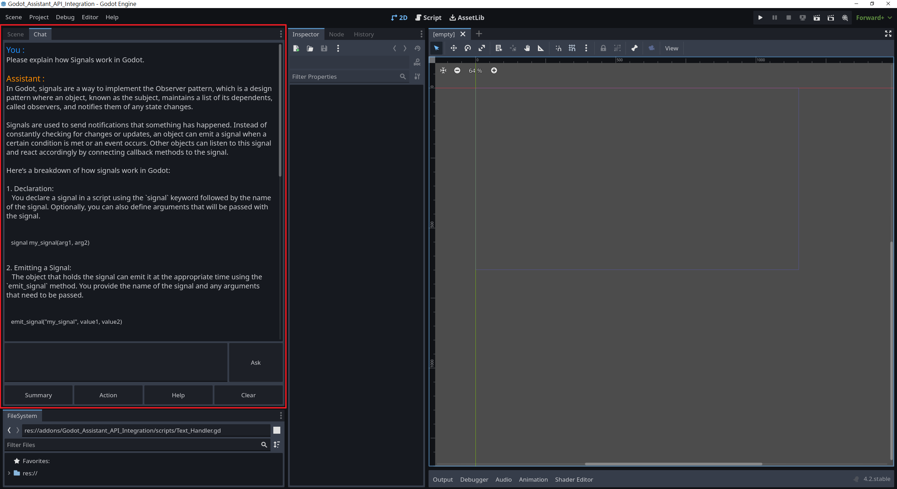
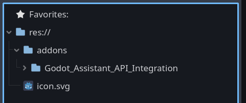
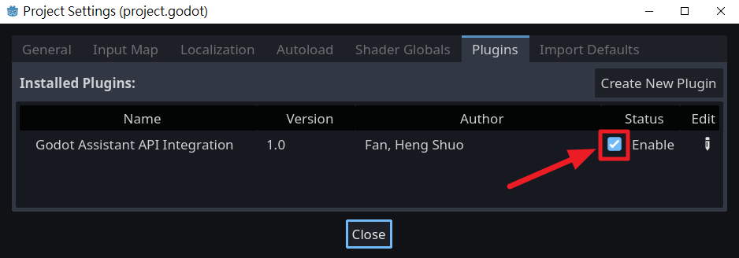

## 專案總結
這是一個 Godot 編輯器 addon (plugin), 可以讓你透過 OpenAI Assistant API 與 Assistant 溝通。

如果你覺得此 addon 對你有幫助, 請考慮[贊助](https://ko-fi.com/amosfan),感激不盡...

## 專案初衷
1. 對於詢問次數較少的使用者而言訂閱 ChatGPT Plus 比使用 OpenAI Assistant API 的成本要高。
2. 在 Godot 編輯器中直接詢問 Assistant 更為便利。

## 功能
1. Ask: 詢問 Assistant 任何問題，如同使用一般的 ChatGPT。
2. Summary: 對選中的程式碼進行總結。
3. Action: 將選中的註解轉化成函數。
4. Help: 協助除錯選中的程式碼。
5. Clear: 清空對話區並更換 Thread。由於設計上，Assistant 會計算同一 Thread 中的所有問答，故此功能可以管理 token 的使用。

## 系統需求
1. 使用 Windows OS （其他 OS 未經測試）。
2. 使用 Godot v.4.2。

## 安裝步驟
1. [建立 OpenAI Assistant](https://platform.openai.com/assistants) 並取得 Assistant ID。   
   可同時設定 Assistant 的 instructions，並勾選 Code interpreter。

2. [取得 OpenAI KEY](https://platform.openai.com/api-keys)
   在 OpenAI 平台 取得 OpenAI KEY。登入後即可免費申請。
   
   
3. 將 API Key 儲存為 Windows 環境變數 "OPENAI_API_KEY"。請確保變數名稱完全一致，否則 addon 將無法找到 API Key。

4. 下載此 repository 並複製 "addon"  資料夾到專案根目錄,
   請參考以下圖示:
   
   

6. 在 Godot編輯器中,
   進入 Project -> Project Setting -> Plugins，勾選 Godot_Assistant_API_Integration 的 status 為 enable。
   

7. 完成後會彈出窗口要求輸入 Assistant ID。輸入後完成所有設定。

8. 注意Godot編輯器中左上角會有 Chat 頁籤, 點擊後即可使用。
  ps. 字數過短的對話會被忽略(這是為了避免誤觸而浪費token..)  
   
## 已知限制
1. 由於 Godot 缺少內建的 Markdown 渲染器，因此程式碼區塊和 Markdown 語法的呈現較不美觀。

2. 此 plugin 製作完成後，我們才發現 Github Copilot 擁有更強大的功能。
   但由於 GDScript 較為小眾，無論是使用 Copilot 還是 Assistant，回應常有不準確之處，如提及不存在或過時的 Class、Function 等。

3. 本 Addon 會等到 Assistant 準備好完整回覆後，才顯示結果。
 （與 ChatGPT 逐字顯示的方式不同）

## 使用建議
1. 當 Assistant 提供的程式碼中出現不存在或過時的 Class、Function 時，建議直接複製貼上 Godot 官網上的函數文檔，並請 Assistant 依據此文檔修正範例，通常能獲得更好的結果。

2. 建議在使用 Github Copilot 與 ChatGPT Plus 之後，再決定是否使用此 Addon。
   雖然 Github Copilot 功能較多，但截至目前（2023/12/11），ChatGPT Plus 在智能上略勝一籌，特別是在撰寫 GDScript 方面。

3. 頻繁使用時，建議直接訂閱 ChatGPT Plus，畢竟其 Markdown 渲染品質更高。

## Q&A
1. Q: 如何確定此 Addon 不會竊取我的 API-Key?
   A: 所有使用到 API Key 的函數都定義在 OpenAI_Communicator.gd 中，
   你可以將整個文件內容複製給 ChatGPT，請它檢查是否有將 API Key 泄漏給非 OpenAI 單位。（答案是沒有）   

2. Q:如何修改各按鈕的預設 prompt？
   A:在 Godot_Assistant_API_Integration.gd 中找到各按鈕的預設 prompt，
   修改後儲存並重新啟用 plugin 即可。  

## 鳴謝
- 此專案最初受 FinePointCGI 啟發. 你可以在 [這裡](https://www.youtube.com/watch?v=s0ETqU1YbLg) 找到他的教學影片.
