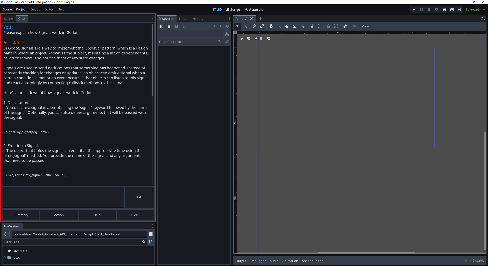

## Project Summary
This is a Godot Editor addon (plugin) that allows you to communicate with the Assistant through the OpenAI Assistant API.

If you find this addon helpful, please consider supporting it with a [donation](https://ko-fi.com/amosfan).

## Project intent
1. For users who ask fewer questions, subscribing to ChatGPT Plus is more costly than using the OpenAI Assistant API.
2. Directly asking the Assistant in the Godot editor is more convenient.

## Features
1. Ask: Ask the Assistant any question, just like using regular ChatGPT.
2. Summary: Summarize selected code.
3. Action: Transform selected comments into functions.
4. Help: Assist in debugging selected code.
5. Clear: Clear the conversation area and switch Thread. Since the Assistant counts all questions and answers in the same Thread, this feature can manage token usage.

## System Requirements
1. Use Windows OS (other OSs not tested).
2. Use Godot v.4.2.

## Installation Steps
1. [Create an OpenAI Assistant](https://platform.openai.com/assistants) and obtain the Assistant ID.
   You can also set the Assistant's instructions and select Code interpreter.

2. [Obtain an OpenAI KEY](https://platform.openai.com/api-keys)
   Get the OpenAI KEY from the OpenAI platform. You can apply for it for free after logging in.

3. Store the API Key as a Windows environment variable "OPENAI_API_KEY". Ensure the variable name is exactly the same, otherwise the addon will not be able to find the API Key.

4. Download this repository and copy the "addon" folder to the project root directory,
   Refer to the following illustration:
   
   

5. In the Godot editor,
   Go to Project -> Project Setting -> Plugins, and select the status of Godot_Assistant_API_Integration as enable.
   

6. After completion, a window will pop up asking for the Assistant ID. Enter it to complete all settings.

7. Note that there will be a Chat tab in the upper left corner of the Godot editor, click it to use.
   ps. Short conversations will be ignored (to avoid wasting tokens due to accidental triggers).

## Known Limitations
1. Since Godot lacks a built-in Markdown renderer, the presentation of code blocks and Markdown syntax is less appealing.

2. After this plugin was completed, we discovered that Github Copilot has more powerful features.
   However, since GDScript is relatively niche, whether using Copilot or Assistant, responses often include inaccuracies, such as mentioning non-existent or outdated Classes, Functions, etc.

3. This Addon waits for the Assistant to prepare a complete reply before displaying the result.
   (Different from ChatGPT's word-by-word display method)

## Usage Suggestions
1. When the Assistant's provided code includes non-existent or outdated Classes, Functions, it's recommended to directly copy and paste the function documentation from the Godot official website, and ask the Assistant to correct the example based on this documentation for better results.

2. It's suggested to decide whether to use this Addon after experiencing Github Copilot and ChatGPT Plus.
   Although Github Copilot has more features, as of now (2023/12/11), ChatGPT Plus is slightly superior in intelligence, especially in writing GDScript.

3. For frequent use, it's recommended to directly subscribe to ChatGPT Plus, given its higher quality of Markdown rendering.

## Q&A
1. Q: How can I be sure this Addon will not steal my API-Key?
   A: All functions using the API Key are defined in OpenAI_Communicator.gd,
   You can copy the entire contents of the file to ChatGPT and ask it to check if the API Key is leaked to non-OpenAI entities. 
   (The answer is no)

2. Q: How to modify the default prompts of each button?
   A: Find the default prompts of each button in Godot_Assistant_API_Integration.gd,
   Modify, save, and then reactivate the plugin.

## Credits
- This project is inspired by FinePointCGI. You can check his tutorial [here](https://www.youtube.com/watch?v=s0ETqU1YbLg).
